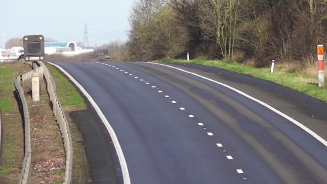
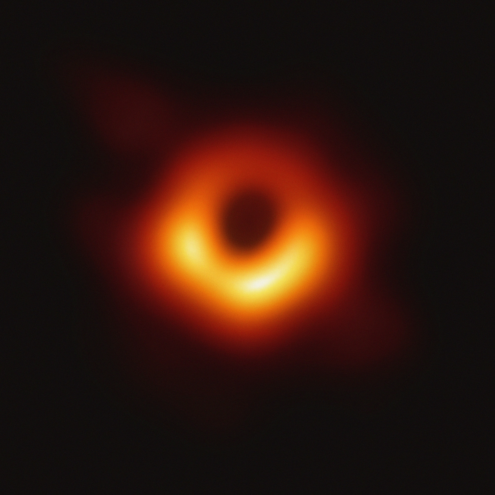

# Assigment 29


# 1. Background Estimation
+ Used opencv ,in this project use a mp4 file as input and averaged every frame of it to make road image without cars.

## How To Install
Run following command:
```
pip install -r requirements.txt
```

## How to Run
Execute this command in terminal:
```
python Background_Estimation.py
```
## Results



# 2. Black Hole
+ There are four input images from this black hole ,with different noise pattern . 
Here we have four slice of "one of mentioned images" , that contain noise :


## How To Install
Run following command:
```
pip install -r requirements.txt
```

## How to Run
Execute this command in terminal:
```
python Black_Hole.py
```
## Results



# 3. Face Morphing
+ A simple face morphing project using opencv with python that morphing human face to an animal face.

## How to Install
Run following command:
```
pip install -r requirments.txt
```
## How to Run
Execute this command in terminal:
```
python Face_Morphing.py
```
## Results


# 4. Find The Secret Text

+ Here we have 2 input images , and the left image contains  hidden text , which we want to detect it with the right one :

## How To Install
Run following command:
```
pip install -r requirements.txt
```

## How to Run
Execute this command in terminal:
```
python Find_The_Secret_Text.py
```
## Results


# 5. Photo to Sketch
+ Used opencv and numpy to convert  your photo to sketch photo.

## How To Install
Run following command:
```
pip install -r requirements.txt
```

## How to Run
Execute this command in terminal:
```
python Photo_To_Sketch.py
```
## Results


# 6. Virtual Decoration
+ Used opencv to change the floor of room.used mask and cv2.muliply and cv2.subtract


## How To Install
Run following command:
```
pip install -r requirements.txt
```

## How to Run
Execute this command in terminal:
```
python Virtual_Decoration.py
```
## Results


